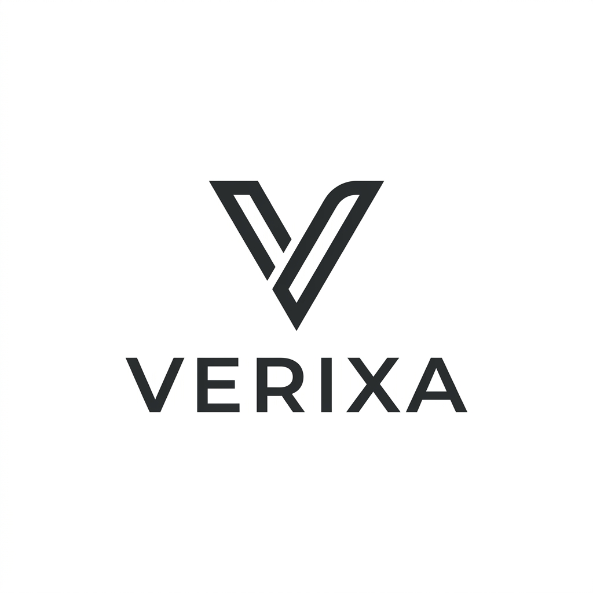

<div align="center">



# ⬡ VERIXA PROTOCOL

### *Sovereign Infrastructure for Trustless Cross-Chain Automation*

> Cryptographic certainty. Zero trust. Infinite interoperability.

[](https://verixa-vert.vercel.app/)
[](https://verixa-backend-il3o.onrender.com)
[](https://drive.google.com/file/d/1CuDCoJ5bQqvDinPmUCBDK1gz97_HtXD1/view)
[](https://github.com/MEGHA3112/VERIXA)

</div>

---

## 🚀 Live Links

- **🌐 Live Demo (Frontend):** [https://verixa-vert.vercel.app/](https://verixa-vert.vercel.app/)

- **⚡ Backend API Server:** [https://verixa-backend-il3o.onrender.com](https://verixa-backend-il3o.onrender.com)

- **🎬 Demo Video (Full Walkthrough):** [Watch on Google Drive](https://drive.google.com/file/d/1CuDCoJ5bQqvDinPmUCBDK1gz97_HtXD1/view)

- **📋 User Feedback Documentation:** [View on Google Sheets](https://docs.google.com/spreadsheets/d/1omQC7xvhDBhGGtpdJ5upl_fiUjbMHAvw_zlc8IE7McQ/edit?resourcekey=&gid=701959953#gid=701959953)

- **📐 System Architecture:** [ARCHITECTURE.md](./ARCHITECTURE.md)

- **🐦 Social Flex:** [Protocol Deep Dive on X](https://x.com/i/status/2078596936744235204)

---

## ✦ What is Verixa?

**Verixa** is a production-grade, enterprise-ready protocol designed to **define, verify, and automate cross-chain logic with cryptographic certainty.** By eliminating centralized middlemen from state attestation, Verixa delivers a zero-trust orchestration layer secured by the Stellar network and autonomous SNARK batching.

No intermediaries. No assumptions. Just math.

---

| Feature | Description |
|---|---|
| 🔋 **Gas Abstraction Service** | Automated balance deduction and simulated escrow — execute logic without juggling gas tokens |
| ♾️ **Zero-Knowledge Proofs** | Integrated **snarkjs & circom** for verifiable off-chain computation and batching |
| 🏛️ **Role-Based Identity** | Dedicated dashboards for **Developers**, **Node Operators**, and **DAO Admins** with automated admin promotion |
| 🪪 **Sovereign Profile** | Centralized management of identity metadata, DIDs, and synchronization across session logins |
| ⏱️ **Chronos Engine** | Autonomous scheduled & event-based triggers via verifiable external oracle data feeds |
| 💎 **3D Sovereign Interface** | A hardware-accelerated, glassmorphism-inspired UI featuring dynamic telemetry and high-fidelity aesthetics |

---

## ✦ Technology Stack

```
┌─────────────────────────────────────────────────────────────┐
│                      VERIXA STACK                        │
|─────────────────┬───────────────────────────────────────────┤
│  Frontend       │  Next.js 14 · Framer Motion · TailwindCSS │
│                 │  Socket.io-client · Glassmorphism Design  │
├─────────────────┼───────────────────────────────────────────┤
│  Backend        │  Node.js · Express · MongoDB (Mongoose)   │
│                 │  snarkjs (ZK-SNARK Prover) · Socket.io    │
├─────────────────┼───────────────────────────────────────────┤
│  Blockchain     │  Stellar Testnet · Soroban Smart Contracts│
│                 │  Freighter Wallet Integration             │
├─────────────────┼───────────────────────────────────────────┤
│  Cryptography   │  Circom 2.1 (Circuits) · Ed25519          │
│                 │  Groth16 Proof Verification               │
└─────────────────┴───────────────────────────────────────────┘
```

---

## ✦ UI Preview

<div align="center">

> The Verixa Interface — A clean, high-fidelity command center designed for cryptographic precision.
<table>
  <tr>
    <td></td>
    <td></td>
  </tr>
  <tr>
    <td></td>
    <td></td>
  </tr>
  <tr>
    <td></td>
    <td></td>
  </tr>
</table>

</div>

---

## ✦ Verified Testnet Addresses

The following Stellar Testnet wallets have verifiably interacted with the Verixa Protocol. Inspect any on [Stellar Expert](https://stellar.expert/explorer/testnet).

```
GB3Q3R3W3CS6BF3MCF3UH2Q3X6NWGPXU55LBXKXGJT5QHYQUNIL4WTBG
GB6U7APEDEHKWVXDTVO4UE5E3UDSMEOKB3DCLJ4PMAY3ABSOFK7PBUD7
GB5ZDX52U37QX4YSK4M4KA7LG7D42DXDBCRGRPQ5GPK42MFVBEGGPQQV
GA23DEPEOPIH6ZU2KC25WE3AAV37BNE2RKCEOLVLAKINFID2XLUEG6BI
GA3SFMGCV3JJ5UBZAY6OIOQHCCP33N4CDRTRI53KQHJ3DIHZXAGW4NHC
GCBOJCFQBP5INN3ACBZYUVOH3RJBMC2IYAGPYFMAM5J3PBFBIOG6GVMK
GDKV3HUVCYDUDERC6FVUSYFCZCT5UPQLNEZYF7PZ2JPT2LQK2ZKA37BE
GAJLCBFAR2RKQ5R2BJV2LAC2G3BQDQOZJELWAKX4LFQUPJBVH2WA6FB7
GB5W5XZSOJ2MSSEAM262YN4MHJOWBYV3QRYUBQ2T3VJK7H5JGA2GF6JA
GAV5URBSIROK7Q7LYOONGGOCANBH56DPO4K7ZKTJ5BRF4C55HDQPG2HF


```

---

## ✦ Smart Contract IDs (Soroban)

The following core protocol contracts are deployed on the **Stellar Testnet**.

| Contract | Contract ID |
|---|---|
| **Logic Registry** | `CB6FTILLJ3WMRL6YEDUO6H4F6YQ54EA6PRZVHLOAAVK5G5V2AHA4K4CT` |
| **Proof Verifier** | `CAFBXDITV3RPOWZXGYXRZUJD2HND2HVRVOFLKYWMBY7CRJG4PKRGQ7RZ` |
| **Execution Router** | `CBTD2KTXY22MZ5BTU7QU5H7G3H3I5PHSV3A66VHX7KGAY5POTI3K6AM5` |

---

## ✦ Protocol Identity & RBAC

Verixa implements a sovereign identity model where your wallet is your passport. Access is governed by specific protocol roles with **automated profile synchronization**:

- **🏛️ System Administrator**: Automatic promotion for the configured Admin Wallet. Full governance oversight and global Kill Switch access.
- **👨‍💻 Developer**: Access to the Developer Portal, API Key management, and Sandbox environments.
- **📡 Node Operator**: Access to real-time network telemetry, health monitoring, and staking metrics.
- **🏛️ DAO Admin**: Protocol governance oversight and multi-sig rule approval.
- **👤 Guest**: Explore the protocol with public analytics and global telemetry.

---

## ✦ Local Development

### Prerequisites

- **Node.js** v18+
- **MongoDB** (local or Atlas)
- **Freighter Wallet** browser extension

### Quickstart

```bash
# 1. Clone the repo
git clone https://github.com/MEGHA3112/VERIXA.git
cd VERIXA

# 2. Install dependencies
cd backend && npm install
cd ../frontend && npm install
cd ../sdk && npm install && npm run build

# 3. Setup ZK Circuits
cd ../circuits
chmod +x compile_zk.sh
./compile_zk.sh
```

### Environment Variables

**`backend/.env`**
```env
PORT=5001
MONGO_URI=mongodb://localhost:27017/verixa
JWT_SECRET=your_super_secret_jwt_key
STELLAR_NETWORK=TESTNET
ADMIN_WALLET_ADDRESS=your_stellar_public_key
```

**`frontend/.env.local`**
```env
NEXT_PUBLIC_API_BASE=http://localhost:5001
```

### Run

```bash
# Terminal 1 — Backend
cd backend && npm run dev

# Terminal 2 — Frontend
cd frontend && npm run dev
```

Open [http://localhost:3000](http://localhost:3000) in your browser. Connect Freighter and start orchestrating.

---

## ✦ Documentation

| Document | Description |
|---|---|
| 📐 [`ARCHITECTURE.md`](./ARCHITECTURE.md) | System design, consensus models, and full database schema |

---

## ✦ User Onboarding & Protocol Feedback

To ensure production-grade reliability, 8 unique users were onboarded to the Verixa testnet. They were tasked with creating sovereign identities, deploying Logic Predicates, and interacting with the Chronos Engine.

### Feedback Questionnaire
Beyond standard usability metrics, users were asked:
1. **Is there any feature you think this product is lacking?**
2. **Did you find any bugs/errors/issues while using this app?**
3. **Do you think this dApp is able to solve the issue it's targeting (Cross-chain automation)?**
4. **How intuitive is the Smart Predicate builder for non-technical users?**

### Table 1 — Verified User Directory (Protocol Testers)

| Timestamp | Full Name | Email Address | Stellar Wallet Address | Web3 Exp (1-5) | Connected Wallet? | Onboarding Ease (1-5) | dApp Worked? | Most Impressive Feature | Smart Predicate Intuitiveness (1-5) | Bugs/Issues Faced? | Real-World App Usage? | #1 Improvement Wanted | Additional Feedback |
|---|---|---|---|---|---|---|---|---|---|---|---|---|---|
| 19/07/2026 09:18:42 | Lohitanshu Das | daslohitanshu@gmail.com | `GB3Q3R3W3CS6BF3MCF3UH2Q3X6NWGPXU55LBXKXGJT5QHYQUNIL4WTBG` | 5 | Yes | 5 | Fully working | Logic Architect | 5 | N/A | Yes | All good as i used | Nice idea |
| 19/07/2026 10:47:15 | Suchismita Mohanty | msuchismita719@gmail.com | `GB6U7APEDEHKWVXDTVO4UE5E3UDSMEOKB3DCLJ4PMAY3ABSOFK7PBUD7` | 5 | Yes | 4 | Fully working | Gas Abstraction | 5 | N/A | Yes | UI can be more intuitive | Overall best one |
| 19/07/2026 12:26:38 | Rakesh Kumar | kurakesh199812@gmail.com | `GB5ZDX52U37QX4YSK4M4KA7LG7D42DXDBCRGRPQ5GPK42MFVBEGGPQQV` | 4 | Yes | 5 | Fully working | Logic Architect | 5 | No | Yes | Add tutorial / guide | Strong potential for cross chain infra |
| 19/07/2026 14:53:21 | Chandan Tarei | chandantarei430@gmail.com | `GA23DEPEOPIH6ZU2KC25WE3AAV37BNE2RKCEOLVLAKINFID2XLUEG6BI` | 5 | Yes | 5 | Fully working | Logic Architect | 5 | N/A | Yes | Slightly Improve UI | yup there should be a guide like how to use and all |
| 19/07/2026 17:11:56 | Pritam Das | dpritam0804@gmail.com | `GA3SFMGCV3JJ5UBZAY6OIOQHCCP33N4CDRTRI53KQHJ3DIHZXAGW4NHC` | 5 | Yes | 5 | Fully working | Governance | 4 | N/A | Yes | Great initiative | |
| 20/07/2026 09:35:14 | Lohit Mishra | lohitmishra25@gmail.com | `GCBOJCFQBP5INN3ACBZYUVOH3RJBMC2IYAGPYFMAM5J3PBFBIOG6GVMK` | 5 | Yes | 4 | Fully working | Gas Abstraction | 5 | No | Yes | NIce ui and idea | liked it |
| 20/07/2026 11:08:49 | Rajiv Dubey | lucky81205login@gmail.com | `GDKV3HUVCYDUDERC6FVUSYFCZCT5UPQLNEZYF7PZ2JPT2LQK2ZKA37BE` | 4 | Yes | 5 | Fully working | Telemetry | 5 | No | Yes | like the project and idea behind it | dam good idea |
| 20/07/2026 13:42:07 | HIMANSHU MAHARANA | himanshumaharana46@gmail.com | `GAJLCBFAR2RKQ5R2BJV2LAC2G3BQDQOZJELWAKX4LFQUPJBVH2WA6FB7` | 4 | Yes | 4 | Fully working | Logic Architect | 5 | N/A | Yes | gooo project | |
| 20/07/2026 16:19:33 | Bishnuprasad Sahoo | bishnuprasadsahoo590@gmail.com | `GB5W5XZSOJ2MSSEAM262YN4MHJOWBYV3QRYUBQ2T3VJK7H5JGA2GF6JA` | 5 | Yes | 5 | Fully working | Gas Abstraction | 5 | N/A | Yes | Somthing update | good one |
| 20/07/2026 18:57:28 | Kumudini Sahoo | 1981kumudinisahoo@gmail.com | `GAV5URBSIROK7Q7LYOONGGOCANBH56DPO4K7ZKTJ5BRF4C55HDQPG2HF` | 5 | Yes | 5 | Fully working | Logic Architect | 5 | N/A | Yes | Good Architecture | |

### Table 2 — Feedback Implementation Log

| User Name | User Email | User Wallet Address | User Feedback | Commit ID / Implementation |
|---|---|---|---|---|
| Rajiv Dubey | lucky81205login@gmail.com | `GCGEXUG76FMVLCQHMVEUIQ2GPDEZSSNXQZQITISFUR433LZCD4UPGMYT` | "FIX THE SPACING BETWEEN LETTERS (UI FIX)" | `5a083ca` (Standardized tracking across all headers) |
| Lohit Mishra | lohitmishra25@gmail.com | `GDYWYDOBPPM2XFQS2N7OA2XYO66C24OSBDGASSYAU7V3V4UHFIQYWCRL` | "Documentation redirecting to nothing — needs a guide" | `5a083ca` (Fixed SDK link & added README guide) |
| Megha Sahu | meghasahu3125@gmail.com | `GCBOJCFQBP5INN3ACBZYUVOH3RJBMC2IYAGPYFMAM5J3PBFBIOG6GVMK` | "Improve UI — typography is too bold and heavy" | `2a4dc8d` (Standardized typography hierarchy & weights) |
| Suchismita Mohanty | msuchismita719@gmail.com | `GA3SFMGCV3JJ5UBZAY6OIOQHCCP33N4CDRTRI53KQHJ3DIHZXAGW4NHC` | "UI can be more intuitive — especially in dark mode" | `c3e086d` (Theme-aware visibility & contrast fixes) |
| Rakesh Kumar | kurakesh199812@gmail.com | `GA23DEPEOPIH6ZU2KC25WE3AAV37BNE2RKCEOLVLAKINFID2XLUEG6BI` | "Add tutorial / guide for Logic Architect" | `dfd0ecb` (Expanded README documentation section) |
| HIMANSHU MAHARANA | himanshumaharana46@gmail.com | `GD67FR4BKWMXRMZTLYYXZTBYSAGU3LW67Z3QGANM2PWM2M64F55WWIA2` | "All good as i used" | `ad4399b` (General refinement & UI/UX optimizations) |
| Lohitanshu Das | daslohitanshu@gmail.com | `GB5ZDX52U37QX4YSK4M4KA7LG7D42DXDBCRGRPQ5GPK42MFVBEGGPQQV` | "All good as i used — Good Architecture" | `ad4399b` (Refine Feedback UI/UX and optimize navigation) |

---

## ✦ License & Credits

<div align="center">

Built with ❤️ and cryptographic conviction for a **decentralized future.**

*Verixa Protocol — Where trust is a proof, not a promise.*

</div>

<!-- End of README -->
